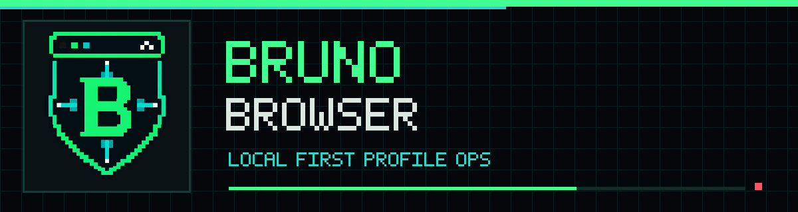

# Bruno Browser

Navegador de perfis local-first para Windows, feito com Go, Wails, React e TypeScript. Cada perfil usa um diretório físico próprio do Chromium, preservando cookies, sessões e armazenamento local no disco.

> Versão atual: **1.3.0** · Windows 10/11 · x64 e ARM64

## Instalação

1. Baixe `Bruno Browser Setup.exe` na [página de Releases](https://github.com/brunooboy/bruno-browser/releases).
2. Abra o instalador e conclua as etapas exibidas.
3. Inicie o Bruno Browser pelo Menu Iniciar ou pelo atalho da área de trabalho.

O instalador identifica automaticamente se o Windows é x64 ou ARM64, instala somente o executável correto e o **Bruno Engine** correspondente em `%LocalAppData%\Programs\Bruno Browser` e não exige privilégios de administrador. O motor é uma compilação oficial e imutável do Chromium, validada por SHA-256 durante o build. Não é necessário instalar Chrome, Edge, Donut Browser ou Wayfern. Se o Microsoft WebView2 Runtime não estiver disponível, o instalador instala o componente incorporado.

O pacote atual ainda não possui assinatura Authenticode. Por isso, o Microsoft SmartScreen pode exibir um aviso em algumas máquinas. Para eliminar esse aviso em distribuição pública é necessário assinar o instalador e o executável com um certificado de assinatura de código confiável.

## Funcionalidades

- Perfis persistentes com `--user-data-dir` exclusivo e restauração de sessão.
- Metadados, plataformas, tags, notas e maturidade por perfil.
- Bruno Engine integrado, com nome, ícone, título de janela e página inicial próprios, iniciado em uma janela separada por perfil.
- Fingerprint persistente por perfil, alinhado ao idioma, fuso, plataforma, hardware e GPU realmente expostos pelo Bruno Engine antes da navegação.
- DuckDuckGo controlado pela extensão nativa Bruno Start e persistido no banco interno de busca de cada perfil.
- Tema escuro do navegador e renderização escura forçada para conteúdo web.
- Proxy HTTP/SOCKS5 por perfil, DNS pelo proxy e proteção contra vazamento WebRTC.
- Cinco políticas DNS por perfil: Leve, Normal (Cloudflare), Alto (Quad9), Pro (AdGuard) e Pro+ (AdGuard Family).
- Cofre de extensões CRX com associação posterior a um ou vários perfis, incluindo o Bruno INSSIST nativo como opção não atribuída por padrão.
- Limpeza seletiva de cache/histórico, cookies/sessão e exclusão de perfil.
- Login Discord OAuth2 Public Client com PKCE e callback local, sem secret no aplicativo.
- Licenças locais AES-256-GCM, planos de 1, 7 e 30 dias ou vitalício.
- Changelog e verificação de atualização por manifesto JSON.
- Tema e central de notificações persistentes.
- Diagnóstico integrado de engine, disco, perfis, rede, extensões, licença e atualizações, com registro local limitado de falhas.
- Backup atômico de `metadata.json` e restauração automática do perfil quando o arquivo principal é interrompido ou corrompido.

As operações premium são validadas novamente pelo backend antes de iniciar perfil, alterar rede ou gerenciar extensões. Remover uma key ou atingir a data de expiração bloqueia essas operações imediatamente. Uma rota HTTP/SOCKS5 pode ser salva com o perfil aberto e entra em vigor na próxima abertura.

## Dados locais

Os dados do usuário ficam em `%AppData%\bruno-browser` e não são removidos na desinstalação:

```text
bruno-browser/
├── account.json
├── appconfig.json
├── extensions/
├── keys-history.json
├── license.json
├── preferences.json
├── diagnostics-log.json     últimas 100 falhas operacionais, sem senhas
├── updates/                 downloads verificados e rollback temporário
└── profiles/
    └── <profile-uuid>/
        ├── metadata.json
        ├── metadata.backup.json
        ├── fingerprint.json
        ├── fingerprint-verification.json
        ├── network.json
        └── chromium/          user-data-dir do navegador
```

O diretório pode ser alterado com `BRUNO_BROWSER_DATA_DIR`. Em desenvolvimento, `BRUNO_BROWSER_EXECUTABLE` permite testar explicitamente outro executável; as releases usam o Bruno Engine instalado ao lado do aplicativo.

## Login Discord sem configuração local

O usuário comum não precisa criar `config.json` ou editar `appconfig.json`. O aplicativo Discord está configurado como **Public Client** e o Bruno Browser usa PKCE S256:

1. O app cria um verificador e um desafio criptográfico descartáveis.
2. Abre a autorização do Discord com o Client ID público incorporado.
3. O Discord retorna para `http://localhost:34115/callback`.
4. O backend Go troca o código usando o verificador PKCE, sem Client Secret.
5. O token é usado apenas para consultar ID, nome e avatar e não é persistido.

`config.json` continua opcional para desenvolvimento, troca de aplicação Discord e definição do `adminDiscordId`. Também são aceitas as variáveis `BRUNO_BROWSER_DISCORD_CLIENT_ID`, `BRUNO_BROWSER_DISCORD_CLIENT_SECRET`, `BRUNO_BROWSER_ADMIN_DISCORD_ID` e `BRUNO_BROWSER_UPDATE_URL`. O campo `discordClientSecret` existe apenas para compatibilidade com aplicações confidenciais antigas e nunca é incluído na release pública.

## Extensões CRX

O botão **Instalar CRX** abre o seletor nativo. O backend valida CRX2/CRX3, extrai o conteúdo com proteção contra caminhos maliciosos e confere o `manifest.json`. A extensão entra primeiro no cofre global; depois o usuário escolhe em quais perfis ela será carregada. Alterações passam a valer na próxima abertura do perfil.

O instalador inclui `Bruno-INSSIST.crx`, validado pelo SHA-256 `1199419B25F78202D0C3CB8828FFCF3CDBB92C8E9C7059B6043F4078EE9070AD`. Na primeira execução ele aparece como **Nativa Bruno**, mas não é ativado em perfil algum até o usuário escolher. Se for desinstalado, o app respeita a decisão e não o reinstala silenciosamente.

## DNS e desafios de segurança

Os presets configuram provedores DoH reais e filtros progressivos. Eles protegem a resolução de nomes, mas não alteram o IP público e não constituem mecanismo de contorno de CAPTCHA. A versão 1.1.0 também remove combinações sorteadas de idioma, fuso, hardware e GPU em runtime; cada perfil passa a usar uma leitura coerente do ambiente real com sua semente local estável. Serviços ainda podem solicitar verificações conforme reputação do IP, comportamento, cookies e estado da conta.

## Atualizações

`internal/updates/version.json` é incorporado ao executável. O `version.json` da raiz pode ser publicado no GitHub e configurado em `updateUrl`, por exemplo:

```text
https://raw.githubusercontent.com/brunooboy/bruno-browser/main/version.json
```

Quando uma versão mais nova existe, o app consulta a Release correspondente no GitHub e só habilita **Baixar e instalar** se encontrar um instalador com digest SHA-256 publicado. A versão instalada baixa o pacote em `%AppData%\bruno-browser\updates`, confere tamanho e hash, fecha os perfis abertos, cria um ponto de restauração e inicia um helper isolado. O backup só é removido depois que a interface da nova versão confirma que iniciou; caso contrário, a instalação anterior é restaurada e reaberta.

A instalação automática é oferecida para o aplicativo instalado em `%LocalAppData%\Programs\Bruno Browser`. Pacotes portáteis continuam apontando para o instalador da Release, pois atualizar arquivos dentro de uma pasta portátil arbitrária não oferece as mesmas garantias de restauração. Sem uma URL configurada, a página de Atualizações continua exibindo o changelog local.

## Desenvolvimento e testes

Requisitos: Go 1.26+, Node.js 22.12+, npm 10+, Windows 10/11 e aproximadamente 3 GB livres para o cache de build. Na primeira compilação, o script baixa os snapshots oficiais x64/ARM64 indicados em `scripts/engine-manifest.json`, valida tamanho e SHA-256, aplica somente os recursos visuais do Bruno Engine (ícone e metadados do executável) e reutiliza o cache nas compilações seguintes.

Para executar como aplicativo desktop real:

```powershell
powershell -ExecutionPolicy Bypass -File .\scripts\run-app.ps1
```

Para validar backend e frontend:

```powershell
powershell -ExecutionPolicy Bypass -File .\scripts\test-app.ps1
```

Para gerar o pacote universal:

```powershell
powershell -ExecutionPolicy Bypass -File .\scripts\build-app.ps1
```

Arquivos gerados em `build\bin`:

- `Bruno Browser Setup.exe`: instalador único para Windows x64 e ARM64, incluindo o Bruno Engine.
- `Bruno Browser.exe`: executável x64 para uso com a pasta `engine` gerada ao lado dele.
- `Bruno Browser-amd64.exe`: binário x64.
- `Bruno Browser-arm64.exe`: binário ARM64.
- `Bruno-Browser-portable-amd64.zip`: pacote portátil completo x64.
- `Bruno-Browser-portable-arm64.zip`: pacote portátil completo ARM64.

Para compilar diretamente o aplicativo e copiar o motor x64 ao lado dele, use `-Direct`. Para pular o instalador, use `-NoInstaller`. Copiar apenas o arquivo `.exe` sem a pasta `engine` não constitui um pacote portátil completo.

## Limites de segurança do licenciamento local

AES-GCM protege a integridade e a confidencialidade contra edição casual. Entretanto, um licenciamento totalmente offline com segredo simétrico dentro do executável não impede um atacante determinado de extrair o segredo e forjar keys. Licenciamento resistente a adulteração exige assinatura assimétrica, mantendo a chave privada fora do aplicativo, ou validação por servidor.

## Licença

Uso privado. Defina uma licença antes de distribuir ou aceitar contribuições públicas.
